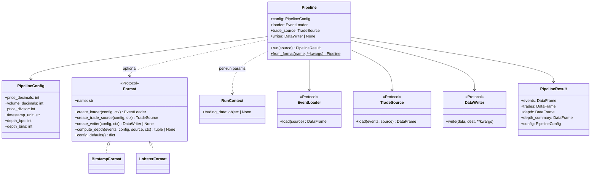

# Architecture

## Pipeline stages

ob-analytics turns **order event streams** and **authoritative trade records**
into structured analytics:

| Stage | What happens |
|-------|-------------|
| **Load & normalize** | Parse Bitstamp CSV or LOBSTER message file into a uniform event DataFrame |
| **Build trades** | Bitstamp: read companion `trades.csv` (live capture). LOBSTER: extract type 4/5 executions from the events frame via `LobsterTradeReader` |
| **Classify orders** | Label each order as *market*, *resting-limit*, *flashed-limit*, *market-limit*, or *unknown* |
| **Depth & metrics** | Track price-level volume, best bid/ask, spread, and liquidity in configurable BPS bins. LOBSTER can use the official orderbook file for ground-truth depth |
| **Flow toxicity** *(post-run)* | VPIN, Kyle's lambda, order-flow imbalance computed from `result.trades` |
| **Visualize / export** | Depth heatmaps, event maps, trade charts, flow-toxicity plots, HTML galleries. Matplotlib (default) or Plotly backend. Parquet and LOBSTER round-trip I/O |

---

## Design decisions

- **DataFrames end to end.** Pandas for speed; the column-list constants and
  `validate_*` functions in `schemas.py` document the column contracts.
- **Two API levels** — `Pipeline` for one-line runs; individual classes
  (`BitstampLoader`, `BitstampTradeReader`, etc.) for step-by-step control.
- **Pluggable everything** — any object with the right method signature works;
  no inheritance required (structural typing via `Protocol`).
- **Per-run parameters live on `RunContext`, not `Format`.** Construction-time
  parameters (schema choice, fixed venue config) belong on the `Format` ctor;
  per-session parameters (trading date, write-time level cap) live on
  `RunContext` and are passed to `Pipeline(format=..., ctx=...)`. This keeps
  formats reusable across multiple runs without re-instantiation and avoids
  baking session state into long-lived objects.

---

## Scale envelope

ob-analytics keeps the full event, depth, and trade tables in memory (pandas), so
the working set scales with the event count. Peak RSS grows roughly **linearly at
~1 GiB per 1M events**, with the depth stages (`price_level_volume` →
`depth_metrics`) dominating both memory and time:

| events  | peak RSS  | depth stages |
|---------|----------:|-------------:|
| 314 k   | ~0.43 GiB | ~14 s |
| 628 k   | ~0.73 GiB | ~25 s |
| 942 k   | ~1.02 GiB | ~38 s |
| 1.26 M  | ~1.32 GiB | ~51 s |

*(Measured with [`scripts/bench_scale.py`](https://github.com/mczielinski/ob-analytics/blob/main/scripts/bench_scale.py): the bundled
~314k-event sample tiled to each size, each size run in its own process, peak RSS
via `getrusage`. Slightly conservative — tiling adds some transient overhead.)*

**Comfortable ceiling ≈ 5M events (~5 GiB)** on a typical 16 GB machine — i.e.
session-scale data, a few hours of a single liquid instrument. For larger inputs
(a full NASDAQ MBO day is **10–100M events**, well past this), the recommended
pattern is to **pre-slice by time window** and process each slice independently,
concatenating the per-slice outputs. ob-analytics deliberately ships no
streaming / out-of-core machinery; pre-slicing keeps the in-memory model simple
and predictable (a chunked-run helper could automate it later if real workloads
demand it).

---

## Class diagram

The package combines **protocol-based** components with **format descriptors**
that bundle venue-specific defaults.



---

## Data formats

| Format | Entry point | Trades |
|--------|-------------|--------|
| **Bitstamp CSV** | `Pipeline()` (default) | Companion `trades.csv` next to `orders.csv` (e.g. `scripts/collect_bitstamp_btcusd.py`) |
| **LOBSTER** | `Pipeline(format=LobsterFormat(), ctx=RunContext(trading_date=...))` | Embedded execution rows (types 4/5) in the message file |

The bundled sample under `ob_analytics/_sample_data/` is a modern BTC/USD
capture (`orders.csv` + `trades.csv`).

---

## Module map

```
ob_analytics/
├── __init__.py           # Public API surface + format registration + sample_csv_path()
├── _sample_data/         # Bundled Bitstamp sample (orders.csv + trades.csv)
├── pipeline.py           # Pipeline, PipelineResult, register_format
├── config.py             # PipelineConfig (frozen Pydantic model)
├── protocols.py          # EventLoader, TradeSource, DataWriter, Format
├── schemas.py            # column constants + validators (validate_events_df, …)
├── exceptions.py         # ObAnalyticsError hierarchy
├── cli.py                # CLI entry point (process, gallery, bitstamp-demo, lobster-demo, capture)
│
├── bitstamp.py           # BitstampLoader, BitstampTradeReader, BitstampWriter, BitstampFormat
├── lobster.py            # LobsterLoader, LobsterTradeReader, LobsterWriter, LobsterFormat
├── analytics.py          # order_aggressiveness, trade_impacts, set_order_types, order_book
├── depth.py              # DepthMetricsEngine, price_level_volume, depth_metrics, get_spread
├── data.py               # save_data, load_data, writer registry
├── flow_toxicity.py      # compute_vpin, compute_kyle_lambda, order_flow_imbalance, KyleLambdaResult
├── _utils.py             # Validation, numerics, timestamp conversion helpers
│
├── live/                 # Optional live order-book capture ([live] extra)
│   ├── __init__.py       # registry: register_capturer, list_capturers, get_capturer
│   ├── _base.py          # LiveCapturer protocol, CaptureConfig, CaptureResult, CaptureSink
│   ├── _runner.py        # Generic asyncio driver + FileCaptureSink
│   └── bitstamp.py       # BitstampCapturer (built-in)
│
└── visualization/        # Plotting subsystem
    ├── __init__.py       # plot() dispatcher + RENDERERS registry, PlotTheme, save_figure
    ├── gallery.py        # HTML gallery generation
    ├── _data.py          # Shared data prep for plot backends
    ├── _matplotlib.py    # Matplotlib renderers
    └── _plotly.py        # Plotly renderers
```

**`ob_analytics.live`** is an optional async sub-package (install with
`pip install "ob-analytics[live]"`) that captures live exchange data into
the same CSV schema the pipeline reads. Implement the `LiveCapturer`
protocol -- three async-iterator methods (`snapshot`, `stream`,
`shutdown_synthetic_events`) -- and call `register_capturer` to add a
new venue; the registry pattern mirrors `Format` and `register_writer`.
The runner (`run_capturer`) handles persistence, raw-frame archival,
signal handling, and `meta.json` finalisation so capturer authors only
write the per-venue parser.
