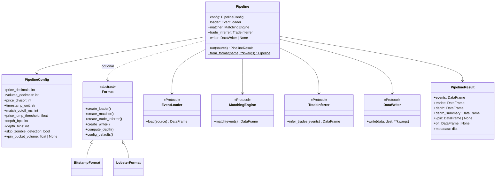

# Architecture

## Pipeline stages

Many exchanges publish only raw **order event streams** (order placed, changed,
cancelled) — not consolidated trade tapes. ob-analytics turns these streams
into structured analytics:

| Stage | What happens |
|-------|-------------|
| **Load & normalize** | Parse Bitstamp CSV or LOBSTER message file into a uniform event DataFrame |
| **Match fills** | Pair simultaneous bid/ask fills — Needleman–Wunsch alignment for Bitstamp; pass-through for LOBSTER (single-sided executions) |
| **Infer trades** | Build trade records with maker/taker attribution |
| **Classify orders** | Label each order as *market*, *resting-limit*, *flashed-limit*, *pacman*, *market-limit*, or *unknown* |
| **Depth & metrics** | Track price-level volume, best bid/ask, spread, and liquidity in configurable BPS bins. LOBSTER can use the official orderbook file for ground-truth depth |
| **Flow toxicity** *(optional)* | VPIN, Kyle's lambda, order-flow imbalance |
| **Visualize / export** | Depth heatmaps, event maps, trade charts, flow-toxicity plots, HTML galleries. Matplotlib (default) or Plotly backend. Parquet and LOBSTER round-trip I/O |

---

## Design decisions

- **DataFrames internally; Pydantic at boundaries.** Pandas for speed;
  `OrderEvent`, `Trade`, etc. document column contracts.
- **Two API levels** — `Pipeline` for one-line runs; individual classes
  (`BitstampLoader`, `BitstampMatcher`, etc.) for step-by-step control.
- **Pluggable everything** — any object with the right method signature works;
  no inheritance required (structural typing via `Protocol`).

---

## Class diagram

The package combines **protocol-based** components with **format descriptors**
that bundle venue-specific defaults.



---

## Data formats

| Format | Entry point | Matcher | Notes |
|--------|-------------|---------|-------|
| **Bitstamp CSV** | `Pipeline()` (default) | Needleman–Wunsch | Single CSV with order events |
| **LOBSTER** | `Pipeline(format=LobsterFormat(trading_date=...))` | Pass-through | Message file + optional orderbook; round-trip I/O via `LobsterWriter` |

The bundled sample CSV was parsed from raw Bitstamp websocket logs using
`scripts/parse_bitstamp_log.sh`. To process your own Bitstamp websocket log
(xz-compressed, one JSON event per line with a millisecond timestamp prefix):

```bash
cd /dir/containing/your/log
bash /path/to/scripts/parse_bitstamp_log.sh   # reads 2015-05-01.log.xz, writes orders.csv
```

Edit the script to change the input filename. The expected input format is:

```
1430524794466 order_changed {"price": "231.00", "amount": "306.59220434", "datetime": "1430524794", "id": 65714203, "order_type": 0}
```

---

## Module map

```
ob_analytics/
├── __init__.py           # Public API surface + format registration + sample_csv_path()
├── _sample_data/         # Bundled Bitstamp sample dataset
│   └── orders.csv
├── pipeline.py           # Pipeline, PipelineResult, register_format
├── config.py             # PipelineConfig (frozen Pydantic model)
├── protocols.py          # EventLoader, MatchingEngine, TradeInferrer, DataWriter, Format
├── models.py             # OrderEvent, Trade, DepthLevel, OrderBookSnapshot, KyleLambdaResult
├── exceptions.py         # ObAnalyticsError hierarchy
├── cli.py                # CLI entry point (process, gallery, bitstamp-demo, lobster-demo)
│
├── bitstamp.py           # BitstampLoader/Matcher/TradeInferrer/Writer/Format + NeedlemanWunschMatcher
├── lobster.py            # LobsterLoader/Matcher/TradeInferrer/Writer/Format
├── analytics.py          # order_aggressiveness, trade_impacts, set_order_types, order_book
├── depth.py              # DepthMetricsEngine, price_level_volume, depth_metrics, get_spread
├── data.py               # save_data, load_data, get_zombie_ids
├── flow_toxicity.py      # compute_vpin, compute_kyle_lambda, order_flow_imbalance
├── _utils.py             # Validation, numerics, timestamp conversion helpers
│
└── visualization/        # Plotting subsystem
    ├── __init__.py       # plot_* dispatchers, PlotTheme, save_figure, backend registry
    ├── gallery.py        # HTML gallery generation
    ├── _data.py          # Shared data prep for plot backends
    ├── _matplotlib.py    # Matplotlib renderers
    └── _plotly.py        # Plotly renderers
```
