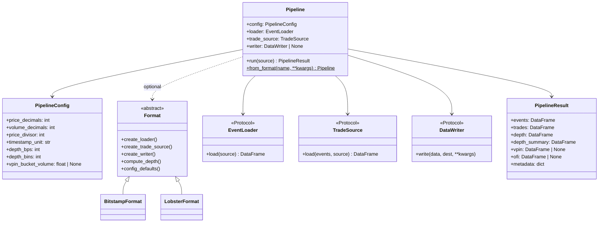

# Architecture

## Pipeline stages

ob-analytics turns **order event streams** and **authoritative trade records**
into structured analytics:

| Stage | What happens |
|-------|-------------|
| **Load & normalize** | Parse Bitstamp CSV or LOBSTER message file into a uniform event DataFrame |
| **Build trades** | Bitstamp: read companion `trades.csv` (live capture). LOBSTER: extract type 4/5 executions from the events frame via `LobsterTradeReader` |
| **Classify orders** | Label each order as *market*, *resting-limit*, *flashed-limit*, *pacman*, *market-limit*, or *unknown* |
| **Depth & metrics** | Track price-level volume, best bid/ask, spread, and liquidity in configurable BPS bins. LOBSTER can use the official orderbook file for ground-truth depth |
| **Flow toxicity** *(optional)* | VPIN, Kyle's lambda, order-flow imbalance |
| **Visualize / export** | Depth heatmaps, event maps, trade charts, flow-toxicity plots, HTML galleries. Matplotlib (default) or Plotly backend. Parquet and LOBSTER round-trip I/O |

---

## Design decisions

- **DataFrames internally; Pydantic at boundaries.** Pandas for speed;
  `OrderEvent`, `Trade`, etc. document column contracts.
- **Two API levels** — `Pipeline` for one-line runs; individual classes
  (`BitstampLoader`, `BitstampTradeReader`, etc.) for step-by-step control.
- **Pluggable everything** — any object with the right method signature works;
  no inheritance required (structural typing via `Protocol`).

---

## Class diagram

The package combines **protocol-based** components with **format descriptors**
that bundle venue-specific defaults.



---

## Data formats

| Format | Entry point | Trades |
|--------|-------------|--------|
| **Bitstamp CSV** | `Pipeline()` (default) | Companion `trades.csv` next to `orders.csv` (e.g. `scripts/collect_bitstamp_btcusd.py`) |
| **LOBSTER** | `Pipeline(format=LobsterFormat(trading_date=...))` | Embedded execution rows (types 4/5) in the message file |

The bundled sample under `ob_analytics/_sample_data/` is a modern BTC/USD
capture (`orders.csv` + `trades.csv`).

---

## Module map

```
ob_analytics/
├── __init__.py           # Public API surface + format registration + sample_csv_path()
├── _sample_data/         # Bundled Bitstamp sample (orders.csv + trades.csv)
├── pipeline.py           # Pipeline, PipelineResult, register_format
├── config.py             # PipelineConfig (frozen Pydantic model)
├── protocols.py          # EventLoader, TradeSource, DataWriter, Format
├── models.py             # OrderEvent, Trade, DepthLevel, OrderBookSnapshot, KyleLambdaResult
├── exceptions.py         # ObAnalyticsError hierarchy
├── cli.py                # CLI entry point (process, gallery, bitstamp-demo, lobster-demo)
│
├── bitstamp.py           # BitstampLoader, BitstampTradeReader, BitstampWriter, BitstampFormat
├── lobster.py            # LobsterLoader, LobsterTradeReader, LobsterWriter, LobsterFormat
├── analytics.py          # order_aggressiveness, trade_impacts, set_order_types, order_book
├── depth.py              # DepthMetricsEngine, price_level_volume, depth_metrics, get_spread
├── data.py               # save_data, load_data, writer registry
├── flow_toxicity.py      # compute_vpin, compute_kyle_lambda, order_flow_imbalance
├── _utils.py             # Validation, numerics, timestamp conversion helpers
│
└── visualization/        # Plotting subsystem
    ├── __init__.py       # plot_* dispatchers, PlotTheme, save_figure, backend registry
    ├── gallery.py        # HTML gallery generation
    ├── _data.py          # Shared data prep for plot backends
    ├── _matplotlib.py    # Matplotlib renderers
    └── _plotly.py        # Plotly renderers
```
