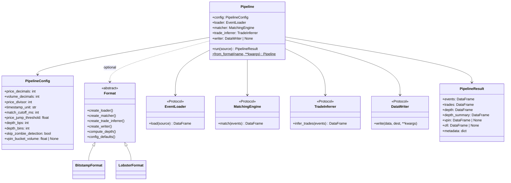

# ob-analytics

[](http://www.gnu.org/licenses/gpl-2.0.html)
[](https://github.com/mczielinski/ob-analytics/actions/workflows/ci.yml)
[](https://codecov.io/gh/mczielinski/ob-analytics)
[](https://www.python.org)

**Limit order book analytics and visualization for Python.**

Reconstruct trades from raw exchange events, classify order types, compute
depth metrics, and visualize market microstructure — from Bitstamp-style CSVs
or [LOBSTER](https://lobsterdata.com/) message and orderbook files.

> Ported from the R
> [obAnalytics](https://cran.r-project.org/package=obAnalytics) CRAN package.
> Now a standalone Python package with a pipeline API, pluggable formats,
> flow-toxicity metrics, and Matplotlib/Plotly backends.

<p align="center">
  
</p>

---

## Table of Contents

- [Overview](#overview)
- [Installation](#installation)
- [Quickstart](#quickstart)
- [Architecture](#architecture)
- [Data Formats](#data-formats)
- [Demo Scripts](#demo-scripts)
- [CLI](#cli)
- [Configuration](#configuration)
- [Visualization](#visualization)
- [Extending the Package](#extending-the-package)
- [Testing & CI](#testing--ci)
- [Documentation](#documentation)
- [License](#license)

---

## Overview

Many exchanges publish only raw **order event streams** (order placed, changed,
cancelled) — not consolidated trade tapes. ob-analytics turns these streams
into structured analytics:

| Stage | What happens |
|-------|-------------|
| **Load & normalize** | Parse Bitstamp CSV or LOBSTER message file into a uniform event DataFrame |
| **Match fills** | Pair simultaneous bid/ask fills — Needleman–Wunsch alignment for Bitstamp; pass-through for LOBSTER (single-sided executions) |
| **Infer trades** | Build trade records with maker/taker attribution |
| **Classify orders** | Label each order as *market*, *resting-limit*, *flashed-limit*, *pacman*, *market-limit*, or *unknown* |
| **Depth & metrics** | Track price-level volume, best bid/ask, spread, and liquidity in configurable BPS bins. LOBSTER can use the official orderbook file for ground-truth depth |
| **Flow toxicity** *(optional)* | VPIN, Kyle's lambda, order-flow imbalance |
| **Visualize / export** | Depth heatmaps, event maps, trade charts, flow-toxicity plots, HTML galleries. Matplotlib (default) or Plotly backend. Parquet and LOBSTER round-trip I/O |

---

## Installation

The package is not yet published on PyPI. Install directly from GitHub:

```bash
pip install git+https://github.com/mczielinski/ob-analytics.git
```

With [uv](https://github.com/astral-sh/uv):

```bash
uv add git+https://github.com/mczielinski/ob-analytics.git
```

From a local clone:

```bash
git clone https://github.com/mczielinski/ob-analytics.git
cd ob-analytics
pip install -e .
```

Interactive Plotly figures (optional):

```bash
pip install "ob-analytics[interactive]"
```

**Requires** Python 3.11+. Core dependencies: NumPy, pandas, matplotlib,
seaborn, pydantic, pyarrow, loguru.

---

## Quickstart

### Pipeline (one line)

The default pipeline processes Bitstamp-format CSV files. A sample dataset
(~5 hours of Bitstamp BTC/USD events) is bundled with the package.

```python
from ob_analytics import Pipeline, sample_csv_path

result = Pipeline().run(sample_csv_path())

result.events       # enriched events with order types and aggressiveness
result.trades       # inferred trades with maker/taker attribution
result.depth        # price-level volume time series
result.depth_summary  # best bid/ask, BPS bins, spread
result.metadata     # provenance (source, format, row counts, config snapshot)
```

### LOBSTER

```python
from ob_analytics import Pipeline, LobsterFormat

result = Pipeline(format=LobsterFormat(trading_date="2012-06-21")).run(
    "/path/to/lobster_data"
)
```

### Step-by-step (full control)

```python
from ob_analytics import (
    BitstampLoader, BitstampMatcher, BitstampTradeInferrer,
    set_order_types, get_zombie_ids, price_level_volume,
    depth_metrics, order_aggressiveness, get_spread,
    plot_price_levels, save_figure, sample_csv_path,
)

loader = BitstampLoader()
events = loader.load(sample_csv_path())

matcher = BitstampMatcher()
events = matcher.match(events)

inferrer = BitstampTradeInferrer()
trades = inferrer.infer_trades(events)

events = set_order_types(events, trades)
zombie_ids = get_zombie_ids(events, trades)
events = events[~events["id"].isin(zombie_ids)]
depth = price_level_volume(events)
depth_summary = depth_metrics(depth)
events = order_aggressiveness(events, depth_summary)

spread = get_spread(depth_summary)
fig = plot_price_levels(depth, spread, trades, volume_scale=1e-8)
save_figure(fig, "price_levels.png")
```

All plot functions accept an `ax` parameter for subplot composition.

---

## Architecture

The package combines **protocol-based** components with **format descriptors**
that bundle venue-specific defaults.


```mermaid
classDiagram
    class Pipeline {
        +config: PipelineConfig
        +loader: EventLoader
        +matcher: MatchingEngine
        +trade_inferrer: TradeInferrer
        +writer: DataWriter | None
        +run(source) PipelineResult
        +from_format(name, **kwargs)$ Pipeline
    }

    class PipelineConfig {
        +price_decimals: int
        +volume_decimals: int
        +price_divisor: int
        +timestamp_unit: str
        +match_cutoff_ms: int
        +price_jump_threshold: float
        +depth_bps: int
        +depth_bins: int
        +skip_zombie_detection: bool
        +vpin_bucket_volume: float | None
    }

    class Format {
        <<abstract>>
        +create_loader()
        +create_matcher()
        +create_trade_inferrer()
        +create_writer()
        +compute_depth()
        +config_defaults()
    }

    class BitstampFormat
    class LobsterFormat

    class EventLoader {
        <<Protocol>>
        +load(source) DataFrame
    }
    class MatchingEngine {
        <<Protocol>>
        +match(events) DataFrame
    }
    class TradeInferrer {
        <<Protocol>>
        +infer_trades(events) DataFrame
    }
    class DataWriter {
        <<Protocol>>
        +write(data, dest, **kwargs)
    }

    class PipelineResult {
        +events: DataFrame
        +trades: DataFrame
        +depth: DataFrame
        +depth_summary: DataFrame
        +vpin: DataFrame | None
        +ofi: DataFrame | None
        +metadata: dict
    }

    Pipeline --> PipelineConfig
    Pipeline --> EventLoader
    Pipeline --> MatchingEngine
    Pipeline --> TradeInferrer
    Pipeline --> DataWriter
    Pipeline --> PipelineResult
    Pipeline ..> Format : optional
    Format <|-- BitstampFormat
    Format <|-- LobsterFormat
```

**Design decisions:**

- **DataFrames internally; Pydantic at boundaries.** Pandas for speed;
  `OrderEvent`, `Trade`, etc. document column contracts.
- **Two API levels** — `Pipeline` for one-line runs; individual classes
  (`BitstampLoader`, `BitstampMatcher`, etc.) for step-by-step control.
- **Pluggable everything** — any object with the right method signature works;
  no inheritance required (structural typing via `Protocol`).

### Module map

```
ob_analytics/
├── __init__.py           # Public API surface + format registration + sample_csv_path()
├── _sample_data/         # Bundled Bitstamp sample dataset
│   └── orders.csv
├── pipeline.py           # Pipeline, PipelineResult, register_format
├── config.py             # PipelineConfig (frozen Pydantic model)
├── protocols.py          # EventLoader, MatchingEngine, TradeInferrer, DataWriter, Format
├── models.py             # OrderEvent, Trade, DepthLevel, OrderBookSnapshot, KyleLambdaResult
├── exceptions.py         # ObAnalyticsError hierarchy
├── cli.py               # CLI entry point (process, gallery, bitstamp-demo, lobster-demo)
│
├── bitstamp.py           # BitstampLoader/Matcher/TradeInferrer/Writer/Format
├── lobster.py            # LobsterLoader/Matcher/TradeInferrer/Writer/Format
├── analytics.py          # order_aggressiveness, trade_impacts (format-agnostic)
├── matching_engine.py    # NeedlemanWunschMatcher (internal algorithm)
├── order_types.py        # set_order_types (market, flashed-limit, pacman, …)
├── order_book_reconstruction.py  # Point-in-time book snapshots
├── depth.py              # DepthMetricsEngine, price_level_volume, depth_metrics, get_spread
├── data.py               # save_data, load_data, get_zombie_ids
├── _time_utils.py        # Shared timestamp conversion helpers (epoch ↔ datetime)
├── flow_toxicity.py      # compute_vpin, compute_kyle_lambda, order_flow_imbalance
│
├── visualization.py      # plot_* dispatchers, PlotTheme, save_figure, backend registry
├── gallery.py            # HTML gallery generation
├── _matplotlib.py        # Matplotlib renderers
├── _plotly.py            # Plotly renderers
├── _chart_data.py        # Shared data prep for plot backends
├── _needleman_wunsch.py  # Sequence alignment internals
└── _utils.py             # Validation, numerics helpers
```

---

## Data Formats

| Format | Entry point | Matcher | Notes |
|--------|-------------|---------|-------|
| **Bitstamp CSV** | `Pipeline()` (default) | Needleman–Wunsch | Single CSV with order events |
| **LOBSTER** | `Pipeline(format=LobsterFormat(trading_date=...))` | Pass-through | Message file + optional orderbook; round-trip I/O via `LobsterWriter` |

The bundled sample CSV was parsed from raw Bitstamp websocket logs using
`scripts/parse_bitstamp_log.sh`.

---

## Demo Scripts

Both demo scripts run the full pipeline, save Parquet output, perform a
round-trip write/re-read verification, and generate an HTML plot gallery.

**Bitstamp** (uses bundled or user-supplied CSV):

```bash
uv run python scripts/bitstamp_demo.py
uv run python scripts/bitstamp_demo.py --input path/to/orders.csv
uv run python scripts/bitstamp_demo.py --output ~/Desktop/bitstamp_gallery
```

**LOBSTER** (requires locally available data; `--trading-date` is required):

```bash
uv run python scripts/lobster_demo.py /path/to/lobster_data --trading-date 2012-06-21
uv run python scripts/lobster_demo.py /path/to/lobster_data --trading-date 2012-06-21 --output ~/Desktop/lobster_gallery
```

---

## CLI

Installing the package registers the `ob-analytics` command via
`[project.scripts]` in `pyproject.toml`.

```bash
ob-analytics process orders.csv -o results/
ob-analytics process data/ --format lobster --trading-date 2012-06-21 --gallery
ob-analytics gallery results/parquet/ -o my_gallery/ --volume-scale 1e-8
ob-analytics bitstamp-demo --input orders.csv -o demo_out/
ob-analytics lobster-demo /path/to/lobster_data --trading-date 2012-06-21 -o demo_out/
```

| Subcommand | Description |
|------------|-------------|
| `process` | Run the pipeline on a data source, save Parquet results (optional `--gallery`) |
| `gallery` | Generate an HTML plot gallery from saved Parquet data |
| `bitstamp-demo` | Run the Bitstamp demo (pipeline + gallery) |
| `lobster-demo` | Run the LOBSTER demo on local data (pipeline + gallery) |

Pass `-v` / `--verbose` for debug-level logging.

---

## Configuration

```python
from ob_analytics import PipelineConfig, Pipeline

config = PipelineConfig(
    price_decimals=4,        # FX: 4 decimal places
    match_cutoff_ms=500,     # tighter matching window
    depth_bps=5,             # 5-bps bins
    depth_bins=100,          # 100 bins = 500 bps total
    vpin_bucket_volume=5.0,  # enable VPIN + OFI
)
result = Pipeline(config=config).run("my_data.csv")
```

| Parameter | Default | Description |
|-----------|---------|-------------|
| `price_decimals` | `2` | Decimal places for price rounding |
| `volume_decimals` | `8` | Decimal places for volume rounding |
| `price_divisor` | `1` | Raw price divisor (`10000` for LOBSTER integer prices) |
| `timestamp_unit` | `"ms"` | Integer timestamp unit in source data |
| `match_cutoff_ms` | `5000` | Fill-pairing window for Needleman–Wunsch matcher |
| `price_jump_threshold` | `10.0` | Maker/taker swap heuristic threshold |
| `depth_bps` / `depth_bins` | `25` / `20` | BPS bin width and count |
| `zombie_offset_seconds` | `60` | Warm-up seconds before depth metrics |
| `skip_zombie_detection` | `False` | Skip zombie detection (set `True` for LOBSTER) |
| `vpin_bucket_volume` | `None` | Volume per VPIN bucket; `None` = skip flow toxicity |

---

## Visualization

Plot functions return `matplotlib.figure.Figure` by default. Pass
`backend="plotly"` for interactive figures (requires
`pip install ob-analytics[interactive]`). Functions never call `plt.show()`.

| Function | Description |
|----------|-------------|
| `plot_price_levels` | Depth heatmap with midprice and trade overlay |
| `plot_trades` | Trade price step plot |
| `plot_event_map` | Order placements/cancellations in price–time space |
| `plot_volume_map` | Flashed-order volume |
| `plot_current_depth` | Book snapshot (cumulative volume vs price) |
| `plot_volume_percentiles` | Stacked liquidity in BPS bins over time |
| `plot_events_histogram` | Price or volume distribution by side |
| `plot_time_series` | Generic step plot |
| `plot_vpin` | VPIN with toxicity threshold |
| `plot_order_flow_imbalance` | OFI bars with optional price overlay |
| `plot_kyle_lambda` | Signed volume vs price-change scatter with regression |
| `plot_hidden_executions` | Hidden execution volume (LOBSTER type 5) |
| `plot_trading_halts` | Trade price with shaded halt periods (LOBSTER type 7) |

Theming: `PlotTheme`, `set_plot_theme`, `get_plot_theme`.
Saving: `save_figure(fig, path, dpi=...)`.
Custom backends: `register_plot_backend(name, module_path)`.

---

## Extending the Package

**Custom loader** — implement `load(source) -> DataFrame` with columns matching
`OrderEvent`:

```python
pipeline = Pipeline(loader=MyLoader())
```

**Custom format** — subclass `Format` to bundle loader, matcher, inferrer,
writer, and config defaults, then register:

```python
from ob_analytics import register_format
register_format("myvenue", MyFormat)
result = Pipeline.from_format("myvenue", **kwargs).run(source)
```

**Custom matcher or trade inferrer** — pass directly to `Pipeline`; explicit
arguments override format defaults:

```python
Pipeline(format=LobsterFormat(...), matcher=MyMatcher())
```

---

## Testing & CI

```bash
uv run pytest tests/ -v
uv run pytest tests/ --cov=ob_analytics
uv run ruff check ob_analytics/ tests/        # lint
uv run ruff format --check ob_analytics/ tests/  # format check
uv run ty check ob_analytics/                  # type check (Astral ty)
```

Pytest tests covering loaders, matching, trades, depth, visualization,
LOBSTER paths, and pipeline integration.

**CI** runs automatically on push/PR via GitHub Actions (`.github/workflows/ci.yml`):

- **Lint** — `ruff check` + `ruff format --check`
- **Type check** — `ty check` (Astral's type checker)
- **Test** — `pytest` with coverage on Python 3.11, 3.12, 3.13
- **Coverage** — uploaded to Codecov on push to `main`

---

## Documentation

API reference generated from docstrings using
[Zensical](https://github.com/zensicalHQ/zensical) (installed as a dev
dependency):

```bash
uv run zensical serve      # local preview at http://localhost:8000
uv run zensical build      # static site in site/
```

---

## License

GPL (>= 2)
