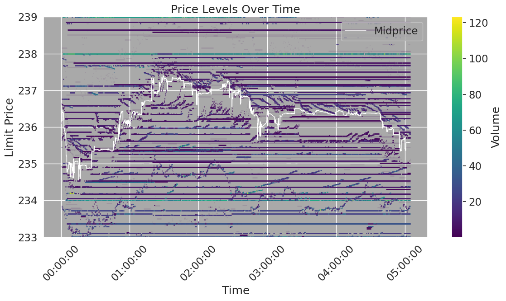

# ob-analytics

[](http://www.gnu.org/licenses/gpl-2.0.html)
[](https://github.com/username/ob-analytics/tree/master/tests)

Limit Order Book event processing and visualization.



**ob-analytics** is a Python package (translated from the original R package) intended for visualization and analysis of limit
order data. The package is experimental and is based on the R code used to
create the visualizations in this original [Limit Order Book Visualisation](http://parasec.net/transmission/order-book-visualisation/)
article.

## Installation

### PyPI (:construction: under construction! :construction:)

```python
pip install ob-analytics
```

### Github

```python
pip install git+https://github.com/mczielinski/ob-analytics.git
```

## Environment settings
For optimal display of data with many columns and timestamps, consider setting pandas display options:

```python
import pandas as pd

# Set display options for better viewing of large dataframes with timestamps
pd.set_option('display.width', 160)
pd.set_option('display.max_columns', None)
pd.set_option('display.precision', 8)
pd.set_option('display.float_format', lambda x: '%.8f' % x)
```

## Example use
Preprocessed limit order data from the package's example directory has been included
in the package. The data, taken from a Bitcoin exchange on 2015-05-01, consists
of 50,393 limit order events and 482 trades occurring from midnight up until
~5am. To load the example data:

```python
import ob_analytics
from ob_analytics.data import process_data

# Load example data 
lob_data = process_data('inst/extdata/orders.csv')
```

The lob_data structure contains 4 pandas DataFrames describing limit order
events, trades, depth and summary statistics. All of which are described in
detail in the package documentation. To visualize all of the example order book
data, use the plot_price_levels function:

```python
from ob_analytics.depth import get_spread
from ob_analytics.visualisation import plot_price_levels
import matplotlib.pyplot as plt

# Get the spread from depth summary
spread = get_spread(lob_data['depth_summary'])

# Visualize price levels with spread
plot_price_levels(lob_data['depth'], spread, volume_scale=10**-8, show_mp=True)
plt.show()
```

## Documentation

## Manual

## License

GPL (>= 2)