# ob-analytics

[](http://www.gnu.org/licenses/gpl-2.0.html)
[](tests/)
[](https://www.python.org)

**Limit order book analytics and visualization for Python.**

Reconstruct trades from raw exchange events, classify order types, compute
depth metrics, and visualize market microstructure — all from a single CSV of
order events.

<p align="center">
  
</p>

> Originally ported from the R
> [obAnalytics](https://cran.r-project.org/package=obAnalytics) CRAN package
> and based on the visualizations in
> [Limit Order Book Visualisation](http://parasec.net/transmission/order-book-visualisation/).
> Now a standalone, extensible Python package with a modern class-based API.

---

## Table of Contents

- [What This Package Does](#what-this-package-does)
- [Installation](#installation)
- [Quickstart](#quickstart)
- [Pipeline Workflow](#pipeline-workflow)
- [Architecture](#architecture)
- [Configuration](#configuration)
- [Visualization](#visualization)
- [Extending the Package](#extending-the-package)
- [API Summary](#api-summary)
- [Testing](#testing)
- [License](#license)

---

## What This Package Does

Many exchanges publish only raw **order event streams** (order placed, changed,
cancelled) — not trade data. ob-analytics solves three problems that no other
Python package combines:

1. **Trade inference** — Reconstructs what trades actually happened by pairing
   simultaneous bid/ask fills, using Needleman-Wunsch sequence alignment for
   ambiguous cases.
2. **Order classification** — Automatically labels orders as *market*,
   *resting-limit*, *flashed-limit* (placed and cancelled in milliseconds),
   *pacman* (sweeps multiple levels), or *market-limit*.
3. **Coordinated visualization** — Seven interlinked plot types designed for
   exploratory microstructure analysis: depth heatmaps, event maps, volume maps,
   order book snapshots, liquidity percentiles, trade charts, and event
   histograms.

### How It Works (30-Second Version)

```
Raw CSV events  ──▸  Parse & deduplicate
                          │
                     Pair bid/ask fills  (Needleman-Wunsch)
                          │
                     Infer trades  (maker vs taker)
                          │
                     Classify order types
                          │
                     Remove zombie orders
                          │
                     Compute depth & metrics
                          │
                     Visualize  ──▸  7 plot types
```

---

## Installation

**From GitHub (recommended):**

```bash
pip install git+https://github.com/mczielinski/ob-analytics.git
```

**With [uv](https://github.com/astral-sh/uv):**

```bash
uv add git+https://github.com/mczielinski/ob-analytics.git
```

**From a local clone:**

```bash
git clone https://github.com/mczielinski/ob-analytics.git
cd ob-analytics
pip install -e .
```

### Requirements

- Python 3.10 – 3.12
- numpy, pandas, matplotlib, seaborn, pydantic, pyarrow

---

## Quickstart

### One-Line Pipeline

```python
from ob_analytics import Pipeline

result = Pipeline().run("inst/extdata/orders.csv")

# result.events     — 50,393 classified order events
# result.trades     — 482 inferred trades
# result.depth      — 49,376 price-level volume updates
# result.depth_summary — depth metrics with bid/ask volume in BPS bins
```

### Step-by-Step (Full Control)

```python
from ob_analytics import (
    load_event_data, event_match, match_trades, set_order_types,
    get_zombie_ids, price_level_volume, depth_metrics, order_aggressiveness,
    get_spread, plot_price_levels, save_figure,
)

# 1. Load and parse raw CSV events
events = load_event_data("inst/extdata/orders.csv")

# 2. Match bid/ask fills (Needleman-Wunsch alignment)
events = event_match(events)

# 3. Infer trades from matched pairs
trades = match_trades(events)

# 4. Classify order types (market, flashed-limit, pacman, etc.)
events = set_order_types(events, trades)

# 5. Remove zombie orders (data quality artifact)
zombie_ids = get_zombie_ids(events, trades)
events = events[~events["id"].isin(zombie_ids)]

# 6. Compute price-level volume over time
depth = price_level_volume(events)

# 7. Compute depth summary metrics (best bid/ask, volume in BPS bins)
depth_summary = depth_metrics(depth)

# 8. Calculate order aggressiveness (distance from best price in BPS)
events = order_aggressiveness(events, depth_summary)

# 9. Visualize
spread = get_spread(depth_summary)
fig = plot_price_levels(depth, spread, trades, volume_scale=1e-8)
save_figure(fig, "price_levels.png")
```

### Subplot Composition

All plot functions accept an optional `ax` parameter, so you can compose them
into multi-panel figures:

```python
import matplotlib.pyplot as plt
from ob_analytics import plot_trades, plot_events_histogram

fig, (ax1, ax2) = plt.subplots(1, 2, figsize=(18, 6))
plot_trades(trades, ax=ax1)
plot_events_histogram(events, val="price", bw=0.25, ax=ax2)
fig.savefig("combined.png", dpi=150)
```

---

## Pipeline Workflow

The pipeline processes raw exchange events through eight sequential stages.
Each stage enriches the data, and the output of one feeds into the next.

```mermaid
flowchart TD
    CSV["📄 Raw CSV\nid · timestamp · price\nvolume · action · direction"]
    CSV --> L["① loadEventData\nParse timestamps, deduplicate,\ncompute fill deltas, assign event IDs"]
    L --> M["② eventMatch\nPair bid/ask fills by volume equality\n+ time proximity (Needleman-Wunsch\nfor ambiguous sequences)"]
    M --> T["③ matchTrades\nConstruct trade records from\nmatched pairs, determine\nmaker vs taker by timestamp"]
    T --> O["④ setOrderTypes\nClassify each order:\nmarket · resting-limit\nflashed-limit · pacman\nmarket-limit · unknown"]
    O --> Z["⑤ getZombieIds\nDetect orders that should have\nbeen cancelled but weren't\n(data quality issue)"]
    Z --> D["⑥ priceLevelVolume\nTrack cumulative volume at\neach price level over time"]
    D --> DM["⑦ depthMetrics\nCompute best bid/ask prices,\nvolumes, and depth in\n25-bps bins out to 500 bps"]
    DM --> A["⑧ orderAggressiveness\nHow far from best price\neach order was placed (BPS)"]

    A --> VIZ["📊 Visualize"]

    style CSV fill:#2d2d2d,stroke:#e94560,color:#fff
    style VIZ fill:#0f3460,stroke:#e94560,color:#fff
```



### What Each Stage Produces

| Stage | Function | Input | Output |
|-------|----------|-------|--------|
| ① | `load_event_data()` | CSV path | Events DataFrame (50,393 rows) |
| ② | `event_match()` | Events | Events + `matching.event` column |
| ③ | `match_trades()` | Matched events | Trades DataFrame (482 rows) |
| ④ | `set_order_types()` | Events + trades | Events + `type` column |
| ⑤ | `get_zombie_ids()` | Events + trades | Set of order IDs to remove |
| ⑥ | `price_level_volume()` | Clean events | Depth DataFrame (49,376 rows) |
| ⑦ | `depth_metrics()` | Depth | Depth summary (45 columns) |
| ⑧ | `order_aggressiveness()` | Events + depth summary | Events + `aggressiveness.bps` |

---

## Architecture

The package uses a **protocol-based, dependency-injection** architecture.
Each core component is defined by a Protocol interface and has a default
implementation that can be swapped out.


### Key Design Decisions

- **DataFrames internally, Pydantic at boundaries.** The pipeline uses pandas
  DataFrames for performance. Pydantic models (`OrderEvent`, `Trade`,
  `DepthLevel`, `OrderBookSnapshot`) define the data contracts and are used for
  validation at input/output boundaries.

- **Backward-compatible wrappers.** Every original function (`load_event_data`,
  `event_match`, `match_trades`, etc.) still works with the same signature.
  The class-based API (`Pipeline`, `BitstampLoader`, etc.) is layered on top.

- **Configurable, not hardcoded.** All magic numbers live in `PipelineConfig`.
  The defaults match the bundled Bitstamp BTC/USD 2015 sample data.

### Module Map

```
ob_analytics/
├── __init__.py              # Public API — everything importable from here
├── pipeline.py              # Pipeline orchestrator + PipelineResult
├── config.py                # PipelineConfig (Pydantic, frozen)
├── protocols.py             # EventLoader, MatchingEngine, TradeInferrer
├── models.py                # OrderEvent, Trade, DepthLevel, OrderBookSnapshot
├── exceptions.py            # ObAnalyticsError hierarchy
│
├── event_processing.py      # BitstampLoader + load_event_data, order_aggressiveness
├── matching_engine.py       # NeedlemanWunschMatcher + event_match
├── trades.py                # DefaultTradeInferrer + match_trades, trade_impacts
├── depth.py                 # DepthMetricsEngine + depth_metrics, price_level_volume
├── order_book_reconstruction.py  # order_book (point-in-time snapshots)
├── order_types.py           # set_order_types (classification logic)
├── data.py                  # process_data, load_data/save_data (Parquet)
│
├── visualisation.py         # PlotTheme + all plot functions
├── _utils.py                # Internal helpers (validation, vector ops)
├── _needleman_wunsch.py     # Sequence alignment algorithm
└── py.typed                 # PEP 561 type-checking marker
```

---

## Configuration

`PipelineConfig` centralizes every tunable parameter. All fields have sensible
defaults for the bundled Bitstamp BTC/USD data.

```python
from ob_analytics import PipelineConfig

# Use defaults
config = PipelineConfig()

# Customize for a different instrument
config = PipelineConfig(
    price_decimals=4,           # FX: 4 decimal places (pips)
    match_cutoff_ms=500,        # Modern venue: tighter matching window
    price_jump_threshold=0.01,  # FX: much smaller price jumps
    depth_bps=10,               # Finer depth bins
    depth_bins=50,              # More bins
)

# Use with Pipeline
from ob_analytics import Pipeline, BitstampLoader
pipeline = Pipeline(config=config, loader=BitstampLoader(config))
result = pipeline.run("my_data.csv")
```

| Parameter | Default | Description |
|-----------|---------|-------------|
| `price_decimals` | `2` | Decimal places for price (2 = cents, 8 = satoshis, 4 = pips) |
| `volume_decimals` | `8` | Decimal places for volume |
| `match_cutoff_ms` | `5000` | Max time window (ms) for bid/ask fill matching |
| `price_jump_threshold` | `10.0` | Price difference ($) triggering maker/taker swap heuristic |
| `depth_bps` | `25` | Width of each depth bin in basis points |
| `depth_bins` | `20` | Number of depth bins per side (20 × 25bps = 500bps) |
| `zombie_offset_seconds` | `60` | Seconds to skip at start for order book population |

**Derived properties:**

- `price_multiplier` — `10 ** price_decimals` (converts float prices to integer units)
- `bps_labels` — `["25bps", "50bps", ..., "500bps"]` (column name suffixes)

---

## Visualization

All plot functions return a `matplotlib.figure.Figure` and accept an optional
`ax` parameter for subplot composition. They never call `plt.show()` — you
control when and how to display or save.

### Available Plots

| Function | What It Shows |
|----------|---------------|
| `plot_trades()` | Trade prices over time (step plot) |
| `plot_price_levels()` | Depth heatmap — volume at every price level through time |
| `plot_event_map()` | Individual order placements/cancellations by price and time |
| `plot_volume_map()` | Flashed order volume distribution over time |
| `plot_current_depth()` | Order book snapshot at a single point in time |
| `plot_volume_percentiles()` | Stacked liquidity in BPS bins through time |
| `plot_events_histogram()` | Price or volume distribution of events |
| `plot_time_series()` | Generic time series step plot |

### Theming

```python
from ob_analytics import PlotTheme, set_plot_theme

# Switch to a light theme
set_plot_theme(PlotTheme(
    style="whitegrid",
    context="talk",
    font_scale=1.2,
    rc={"axes.facecolor": "#f8f9fa"},
))
```

### Saving Figures

```python
from ob_analytics import plot_trades, save_figure

fig = plot_trades(trades)
save_figure(fig, "trades.png", dpi=300)
```

---

## Extending the Package

### Custom Exchange Loader

Implement the `EventLoader` protocol to support any exchange format:

```python
from pathlib import Path
import pandas as pd
from ob_analytics import Pipeline, PipelineConfig

class MyExchangeLoader:
    """Load events from my exchange's CSV format."""

    def __init__(self, config: PipelineConfig | None = None):
        self.config = config or PipelineConfig()

    def load(self, source: str | Path) -> pd.DataFrame:
        df = pd.read_csv(source)
        # Transform columns to match expected schema:
        #   id, timestamp, exchange.timestamp, price, volume,
        #   action (created/changed/deleted), direction (bid/ask),
        #   event.id, fill
        ...
        return df

# Use it
pipeline = Pipeline(loader=MyExchangeLoader())
result = pipeline.run("my_exchange_data.csv")
```

### Custom Matching Algorithm

Replace Needleman-Wunsch with your own logic:

```python
class SimpleTimeMatcher:
    """Match fills purely by closest timestamp."""

    def __init__(self, config: PipelineConfig | None = None):
        self.config = config or PipelineConfig()

    def match(self, events: pd.DataFrame) -> pd.DataFrame:
        # Add 'matching.event' column pairing bid/ask fills
        ...
        return events

pipeline = Pipeline(matcher=SimpleTimeMatcher())
```

### Custom Trade Inferrer

```python
class VWAPTradeInferrer:
    """Infer trades using VWAP-based logic."""

    def __init__(self, config: PipelineConfig | None = None):
        self.config = config or PipelineConfig()

    def infer_trades(self, events: pd.DataFrame) -> pd.DataFrame:
        # Return trades DataFrame with columns:
        #   timestamp, price, volume, direction,
        #   maker.event.id, taker.event.id, maker, taker
        ...
        return trades

pipeline = Pipeline(trade_inferrer=VWAPTradeInferrer())
```

---

## API Summary

### Core Classes

| Class | Module | Description |
|-------|--------|-------------|
| `Pipeline` | `pipeline` | Orchestrates the full processing sequence |
| `PipelineResult` | `pipeline` | Frozen dataclass holding output DataFrames |
| `PipelineConfig` | `config` | Centralized configuration (Pydantic, frozen) |
| `BitstampLoader` | `event_processing` | Loads Bitstamp-format CSVs |
| `NeedlemanWunschMatcher` | `matching_engine` | Matches fills via sequence alignment |
| `DefaultTradeInferrer` | `trades` | Infers trades from matched events |
| `DepthMetricsEngine` | `depth` | Computes depth metrics incrementally |
| `PlotTheme` | `visualisation` | Configurable plot theme |

### Protocols

| Protocol | Method | Description |
|----------|--------|-------------|
| `EventLoader` | `load(source) → DataFrame` | Load raw events from any source |
| `MatchingEngine` | `match(events) → DataFrame` | Pair bid/ask fills |
| `TradeInferrer` | `infer_trades(events) → DataFrame` | Construct trade records |

### Domain Models (Pydantic)

| Model | Fields |
|-------|--------|
| `OrderEvent` | `event_id`, `order_id`, `timestamp`, `exchange_timestamp`, `price`, `volume`, `action`, `direction`, `fill`, `raw_event_type` |
| `Trade` | `timestamp`, `price`, `volume`, `direction`, `maker_event_id`, `taker_event_id` |
| `DepthLevel` | `timestamp`, `price`, `volume`, `side` |
| `OrderBookSnapshot` | `timestamp`, `bids`, `asks` |

### Exceptions

All inherit from `ObAnalyticsError`:

| Exception | When |
|-----------|------|
| `InvalidDataError` | Missing columns, invalid values |
| `MatchingError` | Event matching / trade inference failures |
| `InsufficientDataError` | Empty DataFrames, not enough data |
| `ConfigurationError` | Invalid configuration values |

---

## Testing

```bash
# Run the full test suite (106 tests)
uv run pytest tests/ -v

# With coverage
uv run pytest tests/ --cov=ob_analytics
```

The test suite includes:

- **R parity tests** — Ported from the original R package's test suite
- **Unit tests** — Every public function and class, with synthetic data
- **Integration tests** — Full pipeline run with golden R output comparison
- **Visualization tests** — All plot functions return `Figure`, honor `ax`

---

## Key Concepts

A brief glossary of financial terms used throughout the codebase:

| Term | Meaning |
|------|---------|
| **Limit order book** | Two sorted lists of resting buy (bid) and sell (ask) orders |
| **Spread** | Gap between best bid and best ask price |
| **Maker** | The resting limit order that provides liquidity |
| **Taker** | The incoming order that triggers a trade |
| **Basis points (BPS)** | 1 bps = 0.01%. Normalizes price distances across instruments |
| **Flashed order** | Placed and cancelled within milliseconds (HFT strategy) |
| **Pacman order** | Sweeps through multiple price levels |
| **Zombie order** | Should have been cancelled but wasn't (data quality issue) |
| **Needleman-Wunsch** | Sequence alignment algorithm used to match ambiguous fill pairs |

---

## License

GPL (>= 2)
