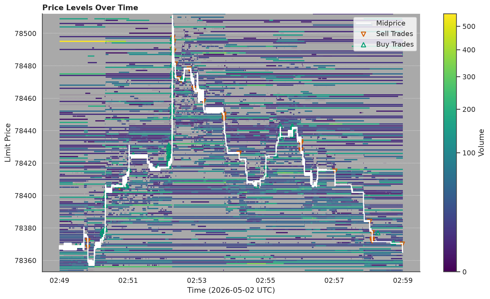
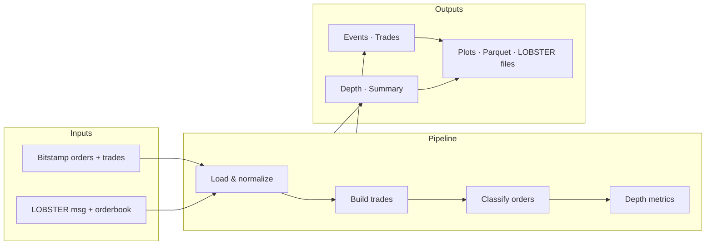

# ob-analytics

**Limit order book analytics and visualization for Python.**

Load order events, attach authoritative trades (Bitstamp `trades.csv` or
LOBSTER executions), classify order types, compute depth metrics, and
visualize market microstructure — from Bitstamp-style CSVs or
[LOBSTER](https://lobsterdata.com/) message and orderbook files.



*Standing volume at every price over ten minutes of the bundled Bitstamp
BTC/USD capture — one of a [dozen figures](gallery/index.md) the package draws.
The [tutorial](tutorial/index.md) builds this one up from first principles.*

Three lines get you there:

```python
from ob_analytics import Pipeline, sample_csv_path

result = Pipeline().run(sample_csv_path())         # load + classify + depth
result.plot("depth_heatmap")                       # the figure above
```

## Explore the docs

<div style="display:flex;flex-wrap:wrap;gap:1rem;margin:1.5rem 0;" markdown>

<div style="flex:1 1 260px;border:1px solid #ccc;border-radius:6px;padding:1rem;" markdown>
### [Getting started](quickstart.md)
Install, run the pipeline on the bundled sample, and render your first plot —
about ten minutes.
</div>

<div style="flex:1 1 260px;border:1px solid #ccc;border-radius:6px;padding:1rem;" markdown>
### [Tutorial](tutorial/index.md)
A guided tour from what a price *is* through L3 order-book reconstruction,
depth, and flow toxicity — every figure built up on toy data first.
</div>

<div style="flex:1 1 260px;border:1px solid #ccc;border-radius:6px;padding:1rem;" markdown>
### [Examples](gallery/index.md)
A gallery of every figure the package draws, each with the exact code that
produced it.
</div>

<div style="flex:1 1 260px;border:1px solid #ccc;border-radius:6px;padding:1rem;" markdown>
### [How-to guides](howto/full-control.md)
Task-focused recipes: your own data, LOBSTER, custom loaders, theming and
export, live capture, the CLI.
</div>

<div style="flex:1 1 260px;border:1px solid #ccc;border-radius:6px;padding:1rem;" markdown>
### [Reference](api/pipeline.md)
Module-by-module API docs, the [data contracts](api/schemas.md), and a
[glossary](glossary.md) of the microstructure terms.
</div>

<div style="flex:1 1 260px;border:1px solid #ccc;border-radius:6px;padding:1rem;" markdown>
### [Architecture](architecture.md)
Pipeline stages, design decisions, the class diagram, the module map, and the
scale envelope.
</div>

</div>

## What it does

| Stage | Description |
|-------|-------------|
| **Load & normalize** | Parse Bitstamp CSV or LOBSTER message file into a uniform event DataFrame |
| **Build trades** | Bitstamp: companion `trades.csv`. LOBSTER: execution rows (types 4/5) in the message file |
| **Classify orders** | Label as market, resting-limit, flashed-limit, market-limit, or unknown |
| **Depth & metrics** | Price-level volume, best bid/ask, spread, liquidity in BPS bins |
| **Flow toxicity** *(post-run)* | VPIN, Kyle's lambda, order-flow imbalance from `result.trades` |
| **Visualize / export** | Depth heatmaps, event maps, trade charts, galleries; Matplotlib or Plotly; Parquet and LOBSTER round-trip I/O |

## Pipeline


```mermaid
flowchart LR
    subgraph in["Inputs"]
        CSV[Bitstamp orders + trades]
        LOB[LOBSTER msg + orderbook]
    end

    subgraph pipeline["Pipeline"]
        direction TB
        L[Load & normalize]
        T[Build trades]
        C[Classify orders]
        D[Depth metrics]
        L --> T --> C --> D
    end

    subgraph out["Outputs"]
        EV[Events · Trades]
        DP[Depth · Summary]
        VZ[Plots · Parquet · LOBSTER files]
    end

    CSV --> L
    LOB --> L
    pipeline --> EV
    pipeline --> DP
    EV & DP --> VZ
```

All processing stages are pluggable via [Protocol interfaces](api/protocols.md).
See the [Architecture](architecture.md) page for the full class diagram, design
decisions, and module map.

## Other data sources

=== "LOBSTER"

    ```python
    from ob_analytics import LobsterFormat, Pipeline, RunContext

    result = Pipeline(
        format=LobsterFormat(),
        ctx=RunContext(trading_date="2012-06-21"),
    ).run("/path/to/lobster_data")
    ```

=== "Command line"

    ```bash
    ob-analytics process orders.csv -o results/
    ob-analytics gallery results/parquet/ -o my_gallery/
    ob-analytics bitstamp-demo --input orders.csv
    ```

    See [Run from the command line](howto/cli.md) for every subcommand.

=== "Your own venue"

    Implement the [`EventLoader`](api/protocols.md) protocol — any object whose
    `load()` returns validator-passing frames is a loader. See
    [Plug in custom components](howto/custom-components.md).
