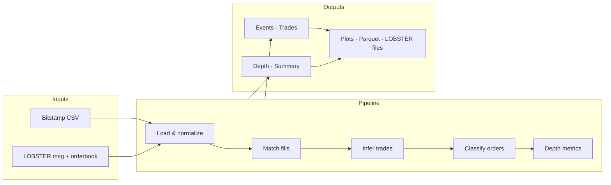

# ob-analytics

**Limit order book analytics and visualization for Python.**

Reconstruct trades from raw exchange events, classify order types, compute
depth metrics, and visualize market microstructure — from Bitstamp-style CSVs
or [LOBSTER](https://lobsterdata.com/) message and orderbook files.

## What it does

| Stage | Description |
|-------|-------------|
| **Load** | Parse Bitstamp CSV or LOBSTER message file into a uniform event DataFrame |
| **Match** | Pair bid/ask fills (Needleman–Wunsch for Bitstamp; pass-through for LOBSTER) |
| **Infer trades** | Build trade records with maker/taker attribution |
| **Classify orders** | Label as market, resting-limit, flashed-limit, pacman, market-limit, or unknown |
| **Depth & metrics** | Price-level volume, best bid/ask, spread, liquidity in BPS bins |
| **Flow toxicity** | VPIN, Kyle's lambda, order-flow imbalance (opt-in) |
| **Visualize** | Depth heatmaps, event maps, trade charts, galleries; Matplotlib or Plotly |

## Architecture


```mermaid
flowchart LR
    subgraph in["Inputs"]
        CSV[Bitstamp CSV]
        LOB[LOBSTER msg + orderbook]
    end

    subgraph pipeline["Pipeline"]
        direction TB
        L[Load & normalize]
        M[Match fills]
        T[Infer trades]
        C[Classify orders]
        D[Depth metrics]
        L --> M --> T --> C --> D
    end

    subgraph out["Outputs"]
        EV[Events · Trades]
        DP[Depth · Summary]
        VZ[Plots · Parquet · LOBSTER files]
    end

    CSV --> L
    LOB --> L
    pipeline --> EV
    pipeline --> DP
    EV & DP --> VZ
```

All processing stages are pluggable via [Protocol interfaces](api/protocols.md).
See the [GitHub README](https://github.com/mczielinski/ob-analytics#architecture)
for a full class diagram and module map.

## Quick example

### Bitstamp (bundled sample)

```python
from ob_analytics import Pipeline

result = Pipeline().run("inst/extdata/orders.csv")
print(result.events.shape, result.trades.shape)
```

### LOBSTER

```python
from ob_analytics import LobsterFormat, Pipeline

result = Pipeline(format=LobsterFormat(trading_date="2012-06-21")).run(
    "/path/to/lobster_data"
)
```

## CLI

A command-line interface is included for common workflows:

```bash
ob-analytics process orders.csv -o results/
ob-analytics gallery results/parquet/ -o my_gallery/
ob-analytics bitstamp-demo --input orders.csv
ob-analytics lobster-demo /path/to/lobster_data --trading-date 2012-06-21
```

See the [Quickstart CLI section](quickstart.md#9-command-line-interface) for
full details.

## Next steps

- **[Quickstart](quickstart.md)** — full walkthrough with visualization, configuration, custom loaders, and CLI
- **[API Reference](api/pipeline.md)** — detailed documentation for every module
- **[CLI Reference](api/cli.md)** — command-line interface API docs
- **[Changelog](changelog.md)** — recent changes
