# ob-analytics

**Limit order book analytics and visualization for Python.**

Reconstruct trades from raw exchange events, classify order types, compute
depth metrics, and visualize market microstructure — all from a single CSV of
order events.

## Features

- **Trade inference** from raw order event streams using Needleman-Wunsch
  sequence alignment
- **Order classification** — market, resting-limit, flashed-limit, pacman,
  market-limit
- **Depth metrics** — best bid/ask, volume in basis-point bins, spread
- **7 coordinated visualization types** — depth heatmaps, event maps, volume
  maps, order book snapshots, liquidity percentiles, trade charts, histograms
- **Extensible** — swap any pipeline component via Protocol interfaces
- **Configurable** — all magic numbers in a single `PipelineConfig`

## Quick Example

```python
from ob_analytics import Pipeline

result = Pipeline().run("inst/extdata/orders.csv")
print(result.events.shape)   # (50393, 13)
print(result.trades.shape)   # (482, 10)
```

## Pipeline Overview

```mermaid
flowchart TD
    CSV["Raw CSV Events"] --> L["① Load & Parse"]
    L --> M["② Match Bid/Ask Fills"]
    M --> T["③ Infer Trades"]
    T --> O["④ Classify Order Types"]
    O --> Z["⑤ Remove Zombies"]
    Z --> D["⑥ Price-Level Volume"]
    D --> DM["⑦ Depth Metrics"]
    DM --> A["⑧ Order Aggressiveness"]
    A --> VIZ["📊 Visualize"]
```



See the [Quickstart](quickstart.md) for a full walkthrough, or jump to the
[API Reference](api/pipeline.md).
